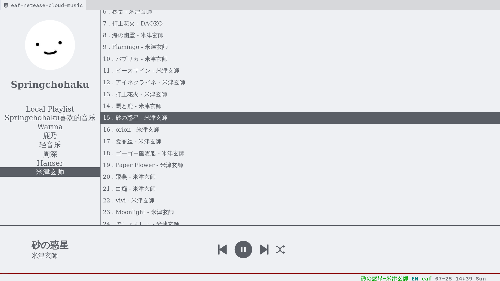

### EAF NetEase Cloud Music
<p align="center">
  
</p>

### Load application

```Elisp
(add-to-list 'load-path "~/.emacs.d/site-lisp/eaf-netease-cloud-music/")
(require 'eaf-netease-cloud-music)
```

NetEase Cloud Music application for the [Emacs Application Framework](https://github.com/emacs-eaf/emacs-application-framework).
